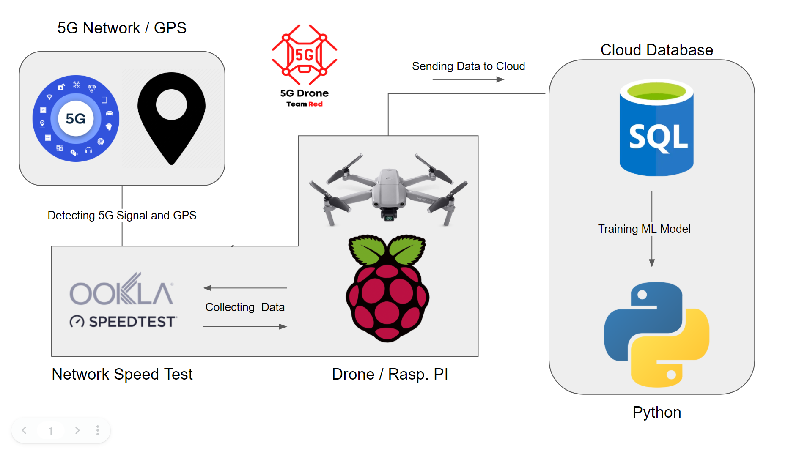

## AT&T 5G Network Drone Testing  - Red Team - Project Description

## Visions and Goals of the Project

Our machine learning model will be used to model 5G network performance for use with commercial drone fleets. High level goals of this project include:

  - Developing a ML model in Python to predict network performance at different altitudes based on network performance on the ground
  - Using the ML model to build a 3D map of AT&T's 5G network (network performance based on GPS coordinates (2 dimensions) + altitude (3rd dimension)

## Users and Personas of this Project

The main beneficiaries of our project are AT&T, who will be able to learn more about the performance of their network in the air to measure the feasibility of deploying a commercial drone fleet connected to AT&T's network.

Additionally any company that doesn't have the ability to implement their own satellite network will be able to use our models to show weather it makes sense to deploy a drone fleet connected to a major ISP's 5G network.

## Scope and Features of the Project

  Collect data used to model 5G network performance:
  
  - Build hardware for data collection
    - Sensors + processor
    - Install hardware on a drone
  - Store data in cloud database
  
  Build machine learning model to model 5G performance with drones
  
  - Predict air performance based on ground performance
  - Predict ground performance based on air performance
  - Use GPS coordinates to build 3D map of network
 
## Solution Concept

**_Figure 1: Proposed solution system including hardware components for data collection and software components for database and model implementation_

Figure 1 demonstrates our initial solution proposal. It includes hardware to be installed on a drone to collect network and positioning data and then send that data to a cloud database. Currently the team consideres MySQL to be the optimal database to store our drone-collected data, as it has optimal functionality with python. The team chose python as the language to develop our ML models in, as it is the current industry standard for developing Machine Learning and A.I. solutions.

**Design Implications and Discussions**

Key Design Decisions and Implementations:

  - Harware suite design: Multiple options for data collection, including using a cell phone or designing our own module using RaspberryPi
  - Database use: multiple options including MySQL, AWS, Google Firebase, Oracle
  - ML model implementation: final decision on which data to use impacts which ML algorithm the team employs in the final product. Currently considering TensorFlow Convolutional Neural Network for classification

## Acceptance Criteria

Minimum viable product (MVP) defined as hardware to measure a drone's real time altitude and the network upload/download speed, the ability to store those data points in a cloud database, and a model to predict air performance based on ground performance with <20% training error and >80% test accuracy. 

## Release Planning

Final product deadline is March 31, 2022
