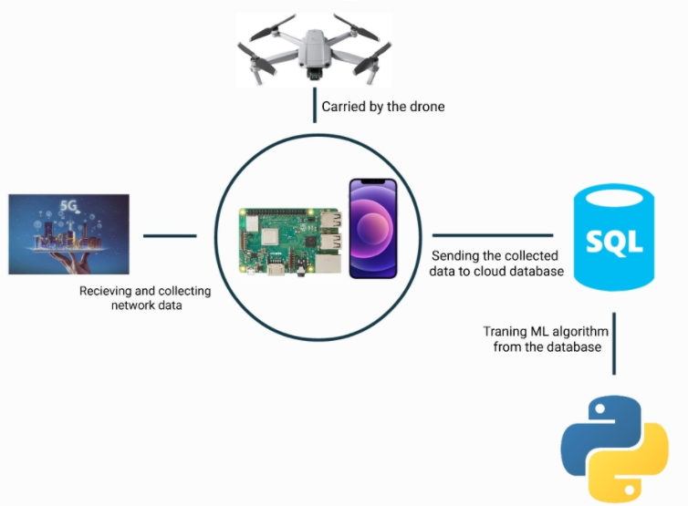

# Drone 5G Network Performance Modeling  - Sky Seer, Red Team

## Project Motivation and Background

This is a research project exploring the feasibility of autonomous unmanned aerial vehicles (UAVs) operating on cellular networks. More companies are experimenting with UAVs for automation and services, such as Amazon’s Prime Air aerial package delivery. UAV fleets would rely on telecommunications networks for connectivity and control and UAVs losing connectivity during operations could potentially be catastrophic. If a UAV were to crash there could be damage to the UAV itself, damage to its payload, damage to other property, and even injury to people in the area. This means that it is very important to ensure telecommunications networks can support future UAV operations. 

The issue is that network infrastructure, such as 5G, is primarily designed to serve ground level or near ground level users, not UAVs that could be flying up to 400 feet above the ground. The project sponsor is AT&T Labs and they are interested in expanding their understanding of how 5G networks perform in the air to eventually determine if current networks are adequate for future UAV operations.

## Goals and Deliverables of the Project

The overall vision of this project is to use machine learning to model 5G network performance up to 400 feet above the ground. Specific deliverables include:

  - Software to automatically run network speed tests and save the results (measure network upload and download speeds)
  - Machine learning model of upload and download speed up to 400 feet above the ground

## Users and Personas of this Project

The main audience of the project is the project sponsor AT&T, who will be able to learn more about the performance of their network in the air to be better informed of the feasibility of deploying a commercial drone fleet connected to a 5G cellular network.

However, this project is a modular framework for data collection and modeling. Essentially any other organization can also use the project to conduct their own modeling of network performance at whatever locations and installations they desire.

## Scope and Features of the Project

  Hardware:
  
  - Quadcopter drone 
  - 5G Android phone
  
  Software:
  
  - Data collection Android application
  - Database to store collected data
  - Machine learning model
  - Web application to control data collection, visualize data, and interact with model
 
## Solution Concept

**_Figure 1: Proposed solution system including hardware components for data collection and software components for database and model implementation_

Figure 1 demonstrates our initial solution proposal. It includes hardware to be installed on a drone to collect network and positioning data and then send that data to a cloud database. Currently the team consideres MySQL to be the optimal database to store our drone-collected data, as it has optimal functionality with python. The team chose python as the language to develop our ML models in, as it is the current industry standard for developing Machine Learning and A.I. solutions.

**Design Implications and Discussions**

Key Design Decisions and Implementations:

  - Harware suite design: Multiple options for data collection, including using a cell phone or designing our own module using RaspberryPi
  - Database use: multiple options including MySQL, AWS, Google Firebase, Oracle
  - ML model implementation: final decision on which data to use impacts which ML algorithm the team employs in the final product. Currently considering TensorFlow Convolutional Neural Network for classification

## Acceptance Criteria

Minimum viable product (MVP) defined as hardware to measure a drone's real time altitude and the network upload/download speed, the ability to store those data points in a cloud database, and a model to predict air performance based on ground performance with <20% training error and >80% test accuracy. 

## Release Planning

Final product deadline is March 31, 2022
