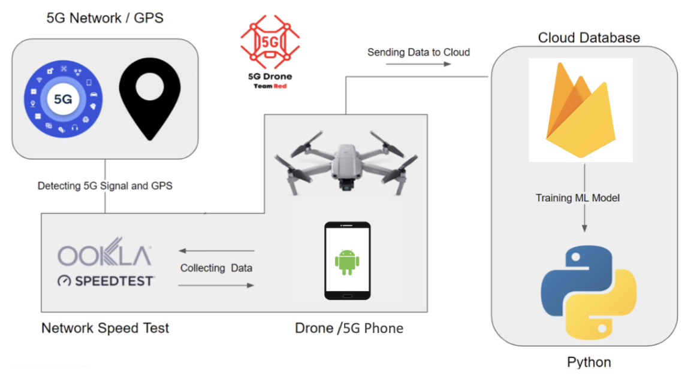

# Drone 5G Network Performance Modeling  - Sky Seer, Red Team

## Software Readme - Data Collection App:
## Software Readme - Machine Learning and Web App:
## Hardware Readme - [wiki](https://github.com/changju784/5G-Network-Drone-Testing/wiki/Hardware#this-serves-as-a-readme-for-the-hardware-specifics-of-the-project)

## Project Motivation and Background

This is a research project exploring the feasibility of autonomous unmanned aerial vehicles (UAVs) operating on cellular networks. More companies are experimenting with UAVs for automation and services, such as Amazon’s Prime Air aerial package delivery. UAV fleets would rely on telecommunications networks for connectivity and control and UAVs losing connectivity during operations could potentially be catastrophic. If a UAV were to crash there could be damage to the UAV itself, damage to its payload, damage to other property, and even injury to people in the area. This means that it is very important to ensure telecommunications networks can support future UAV operations. 

The issue is that network infrastructure, such as 5G, is primarily designed to serve ground level or near ground level users, not UAVs that could be flying up to 400 feet above the ground. The project sponsor is AT&T Labs and they are interested in expanding their understanding of how 5G networks perform in the air to eventually determine if current networks are adequate for future UAV operations.

This README provides general starting information for the project. The finer details of everything can be found in the wiki pages.

## Goals and Deliverables of the Project

The overall vision of this project is to use machine learning to model 5G network performance up to 400 feet above the ground. Specific deliverables include:

  - Software to automatically run network speed tests and save the results (measure network upload and download speeds)
  - Machine learning model of upload and download speeds up to 400 feet above the ground

## Users and Personas of this Project

The main audience of the project is the project sponsor AT&T, who will be able to learn more about the performance of their network in the air to be better informed of the feasibility of deploying a commercial drone fleet connected to a 5G cellular network.

However, this project is a modular framework for data collection and modeling. Essentially any other organization can also use the project to conduct their own modeling of network performance at whatever locations and installations they desire.

## Features of the Project

  Hardware:
  
  - Quadcopter drone 
  - 5G Android phone
  
  Software:
  
  - Data collection Android application
  - Database to store collected data
  - Machine learning model
  - Web application to control data collection, visualize data, and interact with model
 
## Current Project Status

*Fig. 1. Overall system including hardware and software components for data collection, data storage, and model implementation.*

Fig. 1 is an overview of the project. The current iteration of the project consists of installing a 5G Android phone on a drone and flying the drone to various heights above the ground to collect the data used for modeling. The phone runs a custom app that collects network upload speed, download speed, latitude, longitude, and altitude with each test run and pushes it all to a cloud database. Finally, the machine learning code takes the data from the database to carry out the modeling. Not shown in the diagram is the web app, which is for a user to interact with the model and visualize the data. It is also possible to use the web app to remotely control the data collection app on the phone and monitor test run status if a user chooses to do so.

**Design Implications and Discussion**

Key Design Decisions and Implementations:

  - Harware suite design: multiple options for data collection, decided on 5G Android phone using an app developed with the Ookla mobile speedtest SDK
  - Database use: multiple options, decided on Google Firebase Firestore
  - ML model implementation: Python sklearn multi-out regression

It is important to emphasize that the current state of the project is more of a framework for modeling network performance in the air rather than a model that is generalizable over a wide geographic area or a comprehensive 3D map of the Boston area (where data collection was conducted). This project was limited in scale due to only one drone, one team, and time. However, the products of this project can be readily scaled up to accomplish a user's goal.

## Important Miscellaneous Information

1. An important component of this project is collecting data at different heights above the ground. Anyone undertaking such a task must be mindful of the large amount of overhead that comes with legally operating a drone. Once a working drone is obtained, one must thoroughly review the Federal Aviation Administration (FAA) regulations as well as any local regulations for where one is planning to fly. Important tasks to take care of are registering your drone with the FAA, marking your drone with your registration number, and taking an online test to obtain a recreational flyer certificate. Additionally, one must be aware of any airspace restrictions for where flight is planned and apply for access if necessary. Resources for these tasks are provided in the hardware README.

2. Secondly, steadily operating a drone up to hundreds of feet above the ground can be quite difficult. One of the largest challenges encountered with data collection for this project was losing control of the drone because of strong wind. As a result, it is advised that users find flight times when wind gusts are minimal. Since it is not possible to control weather conditions, users should at least be ready to handle strong winds by conducting a lot of practice flying their drone.
